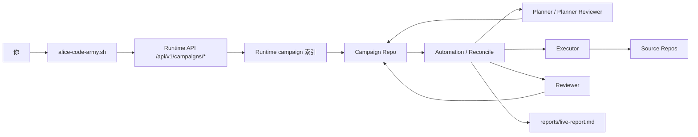
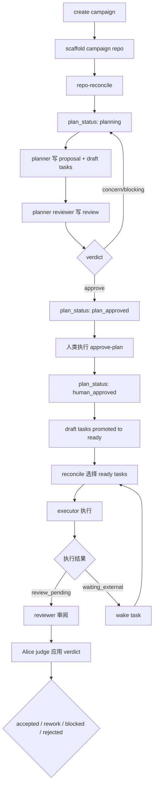
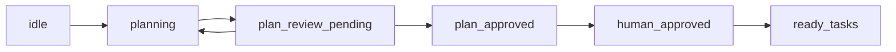
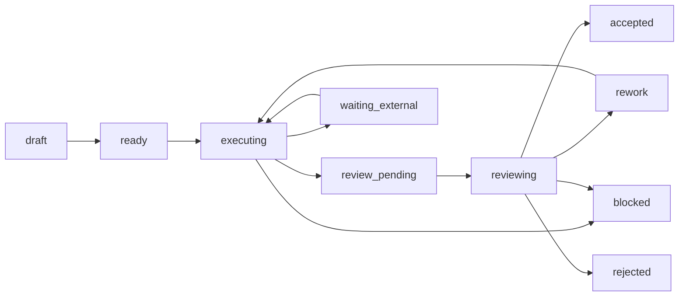

# CodeArmy 使用指南

本文按当前仓库里的真实实现来解释 `alice-code-army` 怎么用，以及它背后的几个部分分别做什么。目标不是只让你记住命令，而是让你建立一套稳定的心智模型，知道什么时候该看 runtime，什么时候该看 campaign repo，为什么 task 会被派发，为什么有时会被阻塞。

如果你只想先抓住一句话，可以记这个：

`CodeArmy = skill 脚本 + runtime campaign 索引 + campaign repo 真相源 + 自动 reconcile/dispatch + source repo 实际改动面`

## 先建立心智模型



这张图里最重要的不是箭头顺序，而是职责边界：

- `runtime campaign 索引` 存轻量运行态，方便当前会话里查询、创建、打补丁。
- `campaign repo` 才是长期协作的主事实源，计划、阶段、任务、评审、报告都落在这里。
- `source repos` 才是真正改业务代码的地方。
- `GitLab issue / MR` 只是可选镜像，不是默认真相源。

## CodeArmy 由哪些部分组成

| 部分 | 在哪里 | 作用 | 你什么时候会碰到 |
| --- | --- | --- | --- |
| 用户入口脚本 | `skills/alice-code-army/scripts/alice-code-army.sh` | 对外提供 `create`、`repo-scan`、`repo-reconcile`、`approve-plan` 等命令 | 你手动操作 campaign 时 |
| Runtime API | `internal/runtimeapi/campaign_handlers.go` | 管理当前会话范围内的 campaign、trial、guidance、review、pitfall | 脚本和 skill 在后台调用 |
| Runtime campaign store | `internal/campaign/*` | 保存轻量 campaign 索引和摘要 | 你执行 `list/get/patch` 时 |
| Campaign repo loader/reconcile | `internal/campaignrepo/*` | 读取 `campaign.md`、`phases/`、`plans/`、`reviews/`，计算状态并生成派发任务 | 你执行 `repo-scan`/`repo-reconcile`，或后台自动跑时 |
| 自动化调度 | `internal/bootstrap/campaign_repo_runtime.go` | 周期性 reconcile，写 live report，同步 dispatch/wake task | 平时不用手动碰，但要理解它在推进流程 |
| Prompt 模板 | `prompts/campaignrepo/*.md.tmpl` | 给 planner、reviewer、executor 生成不同角色 prompt | 想理解 agent 为什么这么工作时 |
| Campaign repo 模板 | `skills/alice-code-army/templates/campaign-repo/` | 创建标准目录结构和初始 markdown | 新建 campaign 时自动 scaffold |

## 最重要的原则：Repo First

`CodeArmy` 现在采用 repo-first 约定。意思是：

- 长期计划、阶段、任务、评审、报告，以 campaign repo 里的 markdown/frontmatter 为主。
- runtime 只保存轻量索引，方便查询当前会话能看到哪些 campaign、当前 summary 是什么、谁能管理。
- source repo 只负责真实代码修改，不复制一份代码到 campaign repo。
- GitLab issue / MR 可以同步，但只是镜像给人看，不是默认主状态源。

可以把它理解成两层状态面：

| 状态面 | 适合放什么 | 不适合放什么 |
| --- | --- | --- |
| runtime campaign | `title`、`objective`、`campaign_repo_path`、`summary`、`max_parallel_trials`、可见性和管理权限 | 详细任务树、计划文档、阶段内进度、review 原文 |
| campaign repo | `campaign.md`、`plans/`、`phases/`、`tasks/`、`reviews/`、`reports/` | 会话路由、scope 权限、运行时索引 |

一个很实用的判断方法：

- 你要查“这次协作完整发生了什么”，去看 campaign repo。
- 你要查“当前会话里有哪些 campaign、当前 summary 是什么”，去看 runtime campaign。

## Campaign Repo 目录怎么读

新建 campaign 后，脚本会把模板材料化成一个标准仓库。你通常会看到这样的结构：

```text
campaign-repo/
  campaign.md
  findings.md
  EXPERIMENT_LOG.md
  docs/
    research-contract.md
  repos/
    README.md
    <repo-id>.md
  plans/
    proposals/
      README.md
      round-001-plan.md
    reviews/
      README.md
      round-001-review.md
    merged/
      master-plan.md
  phases/
    P01/
      phase.md
      tasks/
        README.md
        T001.md
        T002.md
  reviews/
    T001/
      R001.md
  reports/
    live-report.md
    phase-reports/
    final-report.md
  _templates/
    task.md
    review.md
    phase.md
    repo.md
    report.md
    plan-proposal.md
    plan-review.md
```

重点文件解释如下：

| 文件/目录 | 作用 | 你最常看什么 |
| --- | --- | --- |
| `campaign.md` | campaign 总入口，定义目标、当前 phase、默认角色、`plan_status`、`source_repos` | 目标、阶段、默认模型角色、计划状态 |
| `repos/*.md` | 记录 source repo 的本地路径、远端、默认分支、活跃分支 | 本地代码仓库到底在哪 |
| `plans/proposals/` | planner 输出计划 proposal | 当前计划轮次写得是否合理 |
| `plans/reviews/` | planner reviewer 对 proposal 的 verdict | 计划为什么被打回或通过 |
| `plans/merged/master-plan.md` | 当前被认可的总计划 | 人类批准前后，对外统一参考哪份计划 |
| `phases/Pxx/phase.md` | 阶段目标和 gate | 当前阶段做什么、做到什么算过关 |
| `phases/Pxx/tasks/Txxx.md` | 单个任务定义和执行状态 | task 是否 ready / blocked / review_pending |
| `reviews/Txxx/Rxxx.md` | reviewer 对执行结果的评审 | 任务为什么通过或需要返工 |
| `reports/live-report.md` | 系统根据 summary 刷新的实时报告 | 当前有哪些活跃任务、阻塞项、下一步 |
| `findings.md` / `EXPERIMENT_LOG.md` | 横向沉淀关键发现、实验记录 | 避免重复踩坑 |

## `campaign.md` 里最关键的字段

模板里的 `campaign.md` frontmatter 大致长这样：

```yaml
---
campaign_id: camp_xxx
title: "..."
objective: "..."
status: planned
campaign_repo_path: "/path/to/campaign"
current_phase: P01
source_repos: []
default_executor:
  role: executor.codex
default_reviewer:
  role: reviewer.claude
default_planner:
  role: planner
default_planner_reviewer:
  role: planner_reviewer
plan_round: 0
plan_status: idle
---
```

你要重点理解下面这些字段：

| 字段 | 含义 | 什么时候改 |
| --- | --- | --- |
| `campaign_id` | campaign 的唯一标识 | 创建时生成 |
| `objective` | 这次协作到底要达成什么 | 创建时写清楚，后续少改 |
| `current_phase` | 当前主阶段 | 进入新阶段时更新 |
| `source_repos` | 本次涉及的源码仓库标识 | planner/executor 需要据此定位代码 |
| `default_executor` / `default_reviewer` | 默认执行者/审阅者角色配置 | 需要切 provider/model 时改 |
| `default_planner` / `default_planner_reviewer` | 计划阶段角色配置 | 需要替换规划模型时改 |
| `plan_round` | 当前计划轮次 | 系统在 planning/review 循环里递增 |
| `plan_status` | 当前计划状态 | reconcile 和人工审批共同推进 |

## Task 文件怎么理解

每个 task 都是一个小工作包，不只是一个状态标签。模板 frontmatter 里最重要的是这些字段：

```yaml
---
task_id: T001
title: ""
phase: P01
status: draft
depends_on: []
target_repos: []
working_branches: []
write_scope: []
owner_agent: ""
lease_until: ""
dispatch_state: idle
review_status: pending
execution_round: 0
review_round: 0
base_commit: ""
head_commit: ""
last_run_path: ""
last_review_path: ""
wake_at: ""
wake_prompt: ""
report_snippet_path: "results/report-snippet.md"
artifacts: []
result_paths: []
---
```

这些字段里，最决定系统行为的是：

| 字段 | 真正影响什么 |
| --- | --- |
| `status` | 当前 task 所在阶段，决定能不能被选中派发 |
| `depends_on` | 依赖没完成时会直接阻塞 |
| `target_repos` | 标识 task 会改哪些 source repo |
| `write_scope` | 用来判断并行冲突，避免多个 task 同时改同一块 |
| `owner_agent` + `lease_until` | 表示当前有谁持有这个 task，以及租约是否过期 |
| `execution_round` / `review_round` | 第几轮执行、第几轮审阅 |
| `head_commit` | 当前被 review 的 commit |
| `last_run_path` | 上一次执行产物或日志路径 |
| `wake_at` + `wake_prompt` | 长任务等待外部结果时的自动唤醒信息 |

## 角色边界一定要清楚

系统里默认有四类角色：

| 角色 | 主要职责 | 不能做什么 |
| --- | --- | --- |
| planner | 分析代码仓库、写 proposal、生成 draft task | 不直接改 source repo，不改 `campaign.md` |
| planner reviewer | 评估 proposal 是否可执行、任务切分是否合理 | 不直接改 source repo，不替 planner 做规划 |
| executor | 真正做任务，改 source repo 和 task 目录，推进到 `review_pending` 或 `waiting_external` | 不裁决自己是否通过 |
| reviewer | 审代码/产物，写 review 文件给 verdict | 不直接改 source repo，不直接改 task 状态 |

Alice 自己扮演的是 orchestration/judge 角色：

- 负责 reconcile。
- 负责把 review verdict 应用回 task frontmatter。
- 负责刷新 `live-report`。
- 负责把 `wake_at` 同步成真正的自动化唤醒任务。

## 整体流程怎么跑

### 总流程



### 计划阶段状态机



这里每个状态的含义是：

| `plan_status` | 含义 |
| --- | --- |
| `idle` | 刚创建，还没开始 planning |
| `planning` | planner 该出 proposal 了 |
| `plan_review_pending` | proposal 已提交，等 planner reviewer 给 verdict |
| `plan_approved` | 机器评审通过，等人类点头 |
| `human_approved` | 人类已批准，draft task 会在下一次 reconcile 升级成 `ready` |

### 执行阶段状态机



其中最常见的流转是：

- `draft -> ready`：计划已经批准，任务可以进执行队列。
- `ready -> executing`：被 reconcile 选中，并给 executor 上锁。
- `executing -> review_pending`：执行完成，等 reviewer。
- `review_pending -> reviewing`：被选中进入审阅队列。
- `reviewing -> accepted/rework/blocked/rejected`：Alice 读取 review 文件后回写 verdict。

## 从 0 到 1，实际该怎么用

下面给你一条最稳的最小实践路径。为了方便阅读，下面把入口脚本简称为 `alice-code-army.sh`，实际仓库里的位置是 `skills/alice-code-army/scripts/alice-code-army.sh`。

### 1. 先准备运行环境

脚本会按下面顺序找 Alice runtime 二进制：

1. `ALICE_RUNTIME_BIN`
2. `${ALICE_HOME:-$HOME/.alice}/bin/alice`
3. `PATH` 里的 `alice`

所以你至少要保证：

- Alice runtime 二进制可执行。
- 当前会话里能访问 runtime API。
- 本地有要分析/修改的 source repo。

### 2. 创建一个 campaign

```bash
skills/alice-code-army/scripts/alice-code-army.sh create '{
  "title": "Refactor connector retries",
  "objective": "梳理重试策略，降低重复请求，并补齐验证",
  "repo": "group/project",
  "campaign_repo_path": "./campaigns/retry-refactor",
  "max_parallel_trials": 3
}'
```

这一步做了两件事：

- 在 runtime campaign store 里创建一条 campaign。
- 自动 scaffold 一个 campaign repo；如果你没传 `campaign_repo_path`，会默认放到 `./campaigns/<slug>`。

### 3. 补齐 repo 信息和目标约束

创建完以后，先不要急着执行 task，先把 campaign repo 里的事实源写完整：

- 在 `campaign.md` 里确认 `objective`、`source_repos`、默认角色。
- 在 `repos/*.md` 里写清楚每个 source repo 的本地路径、远端、默认分支、当前分支。
- 在 `docs/research-contract.md` 或 `findings.md` 里写清楚约束和已知事实。

如果 `source_repos` 没写清楚，planner 和 executor 都会少上下文。

### 4. 手动触发一次 planning

```bash
skills/alice-code-army/scripts/alice-code-army.sh repo-reconcile camp_xxx
```

`repo-reconcile` 是真正会推进状态的命令。它会：

- 读取 campaign repo。
- 根据当前 `plan_status` 或 task 状态做状态推进。
- 生成 dispatch 任务规格。
- 默认重写 `reports/live-report.md`。
- 默认把 summary 回写到 runtime campaign。

第一次 reconcile 后，`plan_status` 会从 `idle` 进入 `planning`，planner 就有事情可做了。

### 5. 等 planner 产出 proposal 和 draft tasks

planner 被派发后，应该至少产出两类东西：

- `plans/proposals/round-001-plan.md`
- `phases/Pxx/tasks/Txxx.md` 这些 `status: draft` 的任务文件

这一步的重点不是数量，而是切分质量。你要检查：

- task 是否拆得足够清楚。
- `depends_on` 是否准确。
- `target_repos` 是否写对。
- `write_scope` 是否具体、是否互相重叠。

### 6. 等 planner reviewer 审计划

当 proposal 提交后，`plan_status` 会转成 `plan_review_pending`。planner reviewer 会写：

- `plans/reviews/round-001-review.md`

如果 verdict 是：

- `approve`：进入 `plan_approved`
- `concern` 或 `blocking`：回到 `planning`，系统会进入下一轮 `plan_round`

### 7. 人类批准计划

机器评审通过后，还差你这一关：

```bash
skills/alice-code-army/scripts/alice-code-army.sh approve-plan camp_xxx
```

这一步做的不是“立刻开始执行所有任务”，而是：

- 把 runtime campaign 状态补成 `running`
- 把 campaign repo 里的 `plan_status` 改成 `human_approved`

接下来要再跑一次 reconcile，系统才会把 `draft` task 提升成 `ready`。

### 8. 执行阶段开始

再次执行：

```bash
skills/alice-code-army/scripts/alice-code-army.sh repo-reconcile camp_xxx
```

这一次 reconcile 会做两件关键事：

- 从 `ready/rework` 任务里挑出可以并行执行的若干个 task。
- 把这些 task 改成 `executing`，并分配 `owner_agent`、`lease_until`、`execution_round`。

它挑任务时会看三件事：

1. 依赖是否满足：`depends_on` 指向的任务必须已经 `done`。
2. 有没有租约：如果 `owner_agent` 非空且 `lease_until` 还没过，就会阻塞。
3. 有没有冲突：同一 `target_repos` 下，只要 `write_scope` 重叠，就不能并行。

### 9. executor 做完后如何收口

executor 在 source repo 完成代码修改后，应该把 task 推到合适状态：

- 可以评审了：设成 `review_pending`
- 要等外部任务：设成 `waiting_external`，并写 `wake_at` 和 `wake_prompt`
- 实在卡住：设成 `blocked`

同时还应该补：

- `head_commit`
- `last_run_path`
- task 目录下的 `progress.md`、`results/*.md`

### 10. reviewer 只写 review，不改代码

reviewer 收到任务后，会在类似下面的位置写文件：

```text
reviews/T001/R001.md
```

它只负责写 verdict 和 findings，不直接改 source repo，也不直接改 task 状态。下一次 reconcile 时，Alice 会读取 review，并把结果应用成：

- `approve` -> `accepted`
- `concern` -> `rework`
- `blocking` -> `blocked`
- `reject` -> `rejected`

### 11. 长任务怎么等

如果任务要等外部流水线、训练任务或人工反馈，不要让它一直占着 `executing`。应该改成：

- `status: waiting_external`
- `wake_at: 2026-03-26T10:00:00+08:00`
- `wake_prompt: 重新检查训练结果并继续推进`

后台 reconcile 会把它同步成真正的 wake automation task。到点以后，会自动重新唤醒该 task，而不是靠人记住。

### 12. 随时看全局状态

你最常用的两个查看命令是：

```bash
skills/alice-code-army/scripts/alice-code-army.sh repo-scan camp_xxx
skills/alice-code-army/scripts/alice-code-army.sh get camp_xxx
```

区别很重要：

- `repo-scan`：只扫描 repo，返回当前 repo-native summary，不推进状态。
- `get`：只看 runtime campaign 索引。

如果你想看“现在真实任务树卡在哪”，优先看：

- `reports/live-report.md`
- `repo-scan` 输出里的 `summary`

## 怎么写出不会互相打架的 task

这是 `CodeArmy` 最容易写错、也是最影响体验的一部分。

### `depends_on` 怎么写

规则很硬：

- 只要依赖 task 不是 `done`，当前任务就不会进入可执行队列。
- 如果依赖 task 最终是 `rejected`，当前任务会直接显示为依赖阻塞。

所以：

- 真依赖就写，不要偷懒省掉。
- 不是真依赖就不要乱写，否则队列会被你自己锁死。

### `target_repos` 怎么写

它不是备注，而是并行冲突判定的第一层条件。

- 两个 task 不在同一个 `target_repos`，默认不会发生 repo 级冲突。
- 在同一个 repo 里，系统才继续看 `write_scope` 是否重叠。

### `write_scope` 怎么写

系统会把 scope 归一化后做前缀重叠判断。也就是说：

- `internal/connector`
- `internal/connector/retry.go`

这两个会被视为重叠。

还有一个非常关键的规则：

- 同 repo 下，如果任一 task 的 `write_scope` 为空，系统会把它当成潜在全局改动，直接视为冲突。

因此推荐写法是：

- 不要写空。
- 尽量写到目录或模块层级，例如 `internal/connector/retry`、`cmd/connector/runtime_campaign_repo_cmd.go`。
- 不要一上来就写仓库根目录。

### 一个较好的 task frontmatter 示例

```yaml
---
task_id: T012
title: "把 repo-reconcile 和 repo-scan 的行为说明补齐"
phase: P02
status: ready
depends_on:
  - T003
target_repos:
  - alice
working_branches:
  - docs/codearmy-guide
write_scope:
  - docs
  - cmd/connector/runtime_campaign_repo_cmd.go
---
```

这个例子合理的地方在于：

- 依赖明确。
- repo 范围明确。
- 写入范围具体，可与别的任务并行。

## 常用命令怎么选

下面这些是你最常用的命令：

| 命令 | 用途 | 什么时候用 |
| --- | --- | --- |
| `list` | 列出当前会话里可见的 campaign | 想看有哪些活动 campaign |
| `get CAMP_ID` | 查看单个 runtime campaign | 想看 summary、path、meta |
| `create JSON` | 创建 campaign 并默认 scaffold repo | 开新战役 |
| `init-repo CAMP_ID [DIR]` | 给已有 campaign 初始化或补建 repo | 已有 runtime campaign，但 repo 还没建好 |
| `repo-scan CAMP_ID` | 只扫描 repo，输出 summary | 只想观察，不想推进状态 |
| `repo-reconcile CAMP_ID` | 推进 repo 状态，刷新 live report | 想真正让系统继续跑 |
| `plan-status CAMP_ID` | 查看 repo 里的 `plan_status`/`plan_round` | 计划阶段排障 |
| `approve-plan CAMP_ID` | 人类批准计划 | 机器审完 plan 之后 |
| `patch CAMP_ID JSON` | 改 runtime campaign 字段 | 改 summary、状态、path 等 |
| `apply-command CAMP_ID '/alice ...'` | 应用指导命令 | 需要 hold、needs-human、approve-plan、steer 等 |

可选 GitLab 镜像相关命令有：

- `render-issue-note`
- `render-trial-note`
- `sync-issue`
- `sync-trial`
- `sync-all`

它们适合“要给人看”的场景，不适合拿来当主状态源。

## `/alice` 指令会做什么

脚本里内置了几条高频指令，通过 `apply-command` 进入：

```bash
skills/alice-code-army/scripts/alice-code-army.sh apply-command camp_xxx '/alice hold'
skills/alice-code-army/scripts/alice-code-army.sh apply-command camp_xxx '/alice needs-human 缺少线上权限'
skills/alice-code-army/scripts/alice-code-army.sh apply-command camp_xxx '/alice approve-plan'
skills/alice-code-army/scripts/alice-code-army.sh apply-command camp_xxx '/alice steer 优先处理 connector 重试链路'
```

这些命令除了 patch campaign 外，还会把一条 guidance 追加到 runtime campaign 里，留下操作痕迹。

## 后台自动化到底在替你做什么

只要 runtime campaign 不是终态，且 `campaign_repo_path` 不为空，后台会自动参与推进。

当前实现里有几条关键机制：

- 每 `5` 分钟跑一次 campaign repo reconcile。
- dispatch task 和 wake task 会被同步成 automation task。
- dispatch automation task 默认按 `60` 秒间隔存在于调度器中。
- executor/reviewer 的任务租约默认是 `2` 小时。
- reconcile 后会重写 `reports/live-report.md`，并把 summary 同步回 runtime campaign。

所以你平时不一定需要每一步都手动执行命令，但在排障时一定要知道：

- 手动 `repo-reconcile` 是强制推进。
- 后台自动 reconcile 是周期推进。

## 常见误区

### 误区 1：`repo-scan` 为什么没让任务跑起来

因为 `repo-scan` 只扫描，不推进状态。真正会推进状态的是 `repo-reconcile`。

### 误区 2：我已经 `approve-plan` 了，为什么 task 还是 `draft`

因为 `approve-plan` 只是把 `plan_status` 改成 `human_approved`。要等下一次 reconcile，系统才会把 `draft` 提升成 `ready`。

### 误区 3：两个 task 明明改不同文件，为什么还是被判冲突

最常见原因有两个：

- `target_repos` 相同，但其中一个 `write_scope` 为空。
- 你写的是父目录和子目录，例如 `internal/connector` 和 `internal/connector/retry`，系统会认为它们重叠。

### 误区 4：reviewer 为什么不能顺手改两行代码

因为当前工作流明确把 reviewer 限定为“只写审阅结论”。这样 Alice 才能清楚地区分：

- 谁在执行
- 谁在审
- 谁在裁决 verdict

### 误区 5：GitLab issue/MR 里已经有记录了，为什么还要看 campaign repo

因为 GitLab 在这里是镜像面，不是主事实源。真正完整、可机读、可 reconcile 的状态都在 campaign repo。

## 推荐你的最小使用姿势

如果你刚开始用，建议先按这个节奏来：

1. `create` 一个 campaign，让 repo 模板先落地。
2. 补齐 `campaign.md` 和 `repos/*.md`，把目标和本地仓库路径写清楚。
3. 手动跑一次 `repo-reconcile`，让 planning 开始。
4. 检查 planner 生成的 proposal 和 draft tasks，重点看 `depends_on` 和 `write_scope`。
5. 等 plan review 通过后，手动 `approve-plan`。
6. 再跑一次 `repo-reconcile`，让 draft task 升成 `ready` 并开始派发。
7. 始终把 `reports/live-report.md` 当作全局驾驶舱。

## 你应该优先看哪些文件

当你不知道系统现在在干什么时，按这个顺序看最省时间：

1. `reports/live-report.md`
2. `campaign.md`
3. `plans/proposals/round-xxx-plan.md`
4. `plans/reviews/round-xxx-review.md`
5. `phases/Pxx/tasks/Txxx.md`
6. `reviews/Txxx/Rxxx.md`
7. runtime campaign 的 `summary`

如果看完这些文件，你基本就能还原一次 campaign 当前所处的位置。

