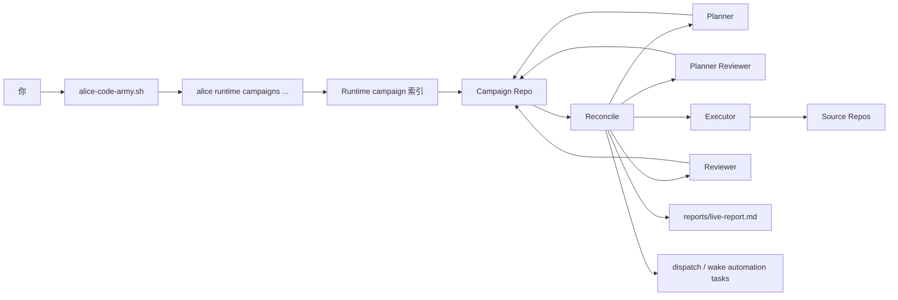
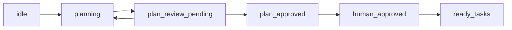
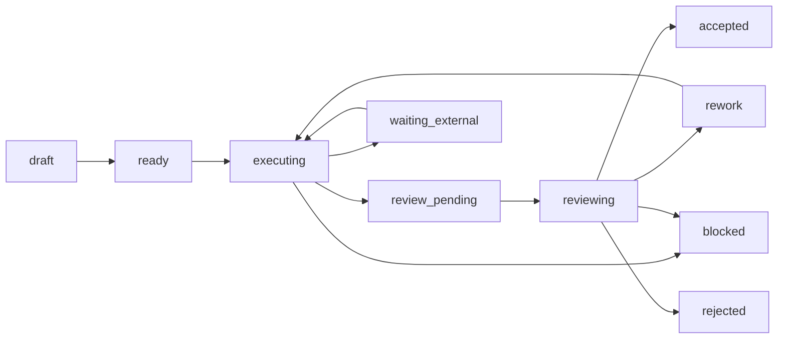

# CodeArmy 使用指南

> **注意**：`alice-code-army` skill 已迁移至独立仓库 https://github.com/Alice-space/codearmy，本文档保留供历史参考。

本文按迁移前的实现说明 `alice-code-army` 怎么工作、哪些状态会自动推进、哪些步骤仍然需要人来拍板。

如果只记一句话，可以先记这个：

`CodeArmy = skill 脚本 + runtime campaign 索引 + campaign repo 真相源 + 自动 reconcile/dispatch + source repo 实际改动面`

如果你是在排查 Alice / CodeArmy 自己的行为，而不是单纯使用它，推荐直接按隔离环境 runbook 做：

- `docs/codearmy-isolated-debug.zh-CN.md`

## 先认清入口

如果你是在 Alice 仓库里开发，脚本路径通常是：

- `skills/alice-code-army/scripts/alice-code-army.sh`

如果你是在本机通过 Alice 安装后的 skill 运行，路径通常是：

- `$HOME/.agents/skills/alice-code-army/scripts/alice-code-army.sh`

脚本会按下面顺序找 Alice runtime 二进制：

1. `ALICE_RUNTIME_BIN`
2. `${ALICE_HOME:-$HOME/.alice}/bin/alice`
3. `PATH` 里的 `alice`

所以最少要满足三件事：

- Alice runtime 可执行。
- 当前会话可以访问 runtime API。
- 本地已经有要分析或修改的 source repo。

## 心智模型



最重要的不是箭头顺序，而是职责边界：

- `runtime campaign` 只存轻量索引、summary、会话范围内的管理信息。
- `campaign repo` 才是长期协作的主事实源。
- `source repos` 才是真正改业务代码的地方。

## CodeArmy 由哪些部分组成

| 部分 | 在哪里 | 作用 | 你什么时候会碰到 |
| --- | --- | --- | --- |
| 用户入口脚本 | `skills/alice-code-army/scripts/alice-code-army.sh` | 对外提供 `create`、`bootstrap`、`repo-scan`、`repo-reconcile`、`approve-plan`、`apply-command` 等命令 | 你手动操作 campaign 时 |
| Runtime API | `internal/runtimeapi/campaign_handlers.go` | 管理当前会话范围内的 campaign 和 repo-based 调度上下文 | skill 脚本在后台调用 |
| Runtime campaign store | `internal/campaign/*` | 保存轻量 campaign 索引和摘要 | 你执行 `list/get/patch` 时 |
| Campaign repo loader/reconcile | `internal/campaignrepo/*` | 读取 `campaign.md`、`plans/`、`phases/` 和 task-local `reviews/`，推进 plan/task 状态并生成 dispatch task | 你执行 `repo-scan`/`repo-reconcile` 或后台自动跑时 |
| 自动化调度 | `internal/bootstrap/campaign_repo_runtime.go` | 周期性 reconcile、事件驱动 reconcile、同步 dispatch/wake task、刷新 live report | 平时不用手动碰，但要理解它在推进流程 |
| Prompt 模板 | `prompts/campaignrepo/*.md.tmpl` | 给 planner、planner reviewer、executor、reviewer 生成 dispatch prompt | 想理解 agent 为什么这么工作时 |
| Campaign repo 模板 | `skills/alice-code-army/templates/campaign-repo/` | 创建标准目录结构和初始 markdown | 新建 campaign 时自动 scaffold |

## Repo First 是什么

`alice-code-army` 现在是标准的 repo-first 结构：

- `campaign repo` 做主事实源：计划、阶段、任务、评审、报告都放在这里。
- `Alice runtime` 做轻量索引层：只记录当前会话绑定哪个 campaign、当前 summary、当前可见范围。
- `source repos` 做真实代码变更面：task 改的是源仓库，不是把代码复制进 campaign repo。

可以把状态拆成三层看：

| 状态面 | 适合放什么 | 不适合放什么 |
| --- | --- | --- |
| runtime campaign | `title`、`objective`、`campaign_repo_path`、`summary`、`status`、可见性和管理权限 | 详细 task 树、计划原文、review 文件 |
| campaign repo | `campaign.md`、`plans/`、`phases/`、task packages、`reports/` | 会话路由、runtime scope 之类的瞬时上下文 |
| source repo | 真正的代码、worktree、分支、提交 | campaign 规划元信息 |

一个简单判断方法：

- 你要查“完整发生了什么”，去看 campaign repo。
- 你要查“当前会话里有哪些 campaign、summary 是什么”，去看 runtime campaign。

补充一点：

- 文档里把 runtime campaign 叫“轻量索引层”，主要是强调它不是 task/review 的主事实源。
- runtime campaign 现在不再持久化 `trials`、`guidance`、`reviews`、`pitfalls` 这类辅助记录；长期状态统一回到 campaign repo。

## Campaign Repo 一般长什么样

新建 campaign 后，模板通常会生成下面这类结构：

```text
campaign-repo/
  .gitignore
  README.md
  campaign.md
  findings.md
  EXPERIMENT_LOG.md
  docs/
    research-contract.md
  repos/
    README.md
    <repo-id>.md
  plans/
    proposals/
      README.md
      README.md
    merged/
      master-plan.md
  phases/
    P01/
      phase.md
      tasks/
        README.md
  reports/
    live-report.md
    phase-reports/
      README.md
    final-report.md
  _templates/
    task.md
    task-context.md
    task-plan.md
    task-progress.md
    task-results-readme.md
    task-reviews-readme.md
    review.md
    phase.md
    repo.md
    report.md
    plan-proposal.md
    plan-review.md
```

初始化模板只保留 `P01` 作为 phase 目录示例；实际需要多少个 phase，应该由 planner 在 proposal 和 merged plan 里决定，而不是由模板预设死。

像 `plans/proposals/round-001-plan.md`、`plans/reviews/round-001-review.md`、`phases/Pxx/tasks/Txxx/task.md`、`phases/Pxx/tasks/Txxx/reviews/R001.md` 这些具体文件，通常是在后续 workflow 里按需要生成，不是初始 scaffold 就全部带好。

最常看的几个位置：

| 文件/目录 | 作用 | 排障时先看什么 |
| --- | --- | --- |
| `README.md` | 给新 agent 的入场说明和推荐阅读顺序 | 应该先看哪些文件、哪些约定不能踩 |
| `campaign.md` | 总目标、frontmatter 状态字段、`source_repos`、gate/roles 说明 | 当前在第几轮 planning、涉及哪些 repo、约束是什么 |
| `repos/*.md` | source repo 的本地路径、远端、分支信息 | 真正代码仓库在哪 |
| `plans/proposals/` | planner 产出的 proposal | 当前计划到底写了什么 |
| `plans/reviews/` | planner reviewer 对 proposal 的评审 | 为什么 plan 被通过或打回 |
| `plans/merged/master-plan.md` | 当前认可的总计划 | 人类批准后应参照哪份计划 |
| `phases/Pxx/tasks/Txxx/` | 单个任务的完整工作包 | executor 只看 task 文件夹能不能开工 |
| `phases/Pxx/tasks/Txxx/reviews/Rxxx.md` | reviewer 的审阅记录 | 为什么通过或返工 |
| `reports/live-report.md` | 系统根据 summary 刷新的全局报告 | 当前活跃任务、阻塞项、下一步 |

## `campaign.md` 里最关键的字段

模板 frontmatter 大致长这样：

```yaml
---
campaign_id: camp_xxx
title: "..."
objective: "..."
campaign_repo_path: "/path/to/campaign"
current_phase: P01
source_repos: []
plan_round: 0
plan_status: idle
---
```

这里的 `role` 是角色标识，不是模型名。campaign 级默认角色到具体 `provider` / `model` / `profile` 的映射现在只来自 `config.yaml` 里的 `campaign_role_defaults` 和 `llm_profiles`；`campaign.md` 不再承载这类默认值。只有 task / review frontmatter 在极少数 one-off override 场景下才需要显式写 `provider` / `model` / `profile`。

这些字段最影响系统行为：

| 字段 | 含义 | 什么时候改 |
| --- | --- | --- |
| `campaign_id` | campaign 唯一标识 | 创建时生成 |
| `objective` | 这次协作到底要达成什么 | 创建时写清楚，后续少改 |
| `current_phase` | 当前主阶段 | 进入新阶段时更新 |
| `source_repos` | 本次涉及的源码仓库标识 | planner/executor 需要据此定位代码 |
| `plan_round` | 当前计划轮次 | planning/review 循环里递增 |
| `plan_status` | 计划阶段当前状态 | reconcile 和人工审批共同推进 |

说明：

- runtime campaign 的总体 `status` 以 runtime campaign 记录为准，用 `alice-code-army.sh get` / runtime campaigns API 查看；`campaign.md` 里不再把它当主事实源。
- queue / ready / blocked 的执行态摘要看 `reports/live-report.md`。

角色默认值现在应该改 `config.yaml`：

- `campaign_role_defaults.*.role` / `workflow`：控制 planner / reviewer / executor 的角色标签与 workflow
- `campaign_role_defaults.*.llm_profile`：指向 `llm_profiles` 的外层名字
- `llm_profiles.<name>`：定义 provider / model / provider-specific `profile` / timeout / prompt prefix 等实际运行配置

## Task frontmatter 里哪些字段最关键

模板里的 task frontmatter 大致是：

```yaml
---
task_id: T001
title: ""
phase: P01
status: draft
depends_on: []
target_repos: []
working_branches: []
write_scope: []
owner_agent: ""
lease_until: ""
executor:
  role: executor
reviewer:
  role: reviewer
dispatch_state: idle
review_status: pending
execution_round: 0
review_round: 0
base_commit: ""
head_commit: ""
last_run_path: ""
last_review_path: ""
wake_at: ""
wake_prompt: ""
report_snippet_path: "results/report-snippet.md"
artifacts: []
result_paths: []
---
```

最重要的是这些：

| 字段 | 真正影响什么 |
| --- | --- |
| `status` | 当前 task 所在阶段，决定能不能被选中派发 |
| `depends_on` | 依赖没完成就会直接阻塞 |
| `target_repos` | 第一层 repo 冲突判定 |
| `write_scope` | 第二层并行冲突判定 |
| `owner_agent` + `lease_until` | 谁持有任务、租约是否还有效 |
| `execution_round` / `review_round` | 第几轮执行、第几轮审阅 |
| `dispatch_state` | 最近一次派发/裁决到哪一步 |
| `review_status` | 审阅队列状态 |
| `head_commit` / `last_run_path` / `last_review_path` | 执行产物和审阅产物锚点 |
| `wake_at` + `wake_prompt` | 长任务唤醒信息 |

补充一条很重要的约束：

- `working_branches` 写的是 task 私有工作分支，不是 source repo 的共享基线分支。
- `main`、`dev`、`rCM` 这类分支不要直接填进 `working_branches`；最稳的做法是保持为空，让 Alice 自动生成隔离的 `codearmy/...` 分支。
- 如果只是想说明“这项修复基于哪个上游分支/commit”，请写在 source repo facts、`base_commit` 或 task 正文里。

## 计划阶段现在是怎么跑的

当前实现里，planner 和 planner reviewer 已经进入真实的 runtime reconcile 流程，不再只是文档约定。

主流程是：



每个状态的含义：

| `plan_status` | 含义 |
| --- | --- |
| `idle` | 刚创建，还没开始 planning |
| `planning` | planner 该产出 proposal 了 |
| `plan_review_pending` | proposal 已提交，等待 planner reviewer 给 verdict |
| `plan_approved` | 机器评审通过，等待人类批准 |
| `human_approved` | 人类已批准，下一次 reconcile 会把 `draft` task 提升成 `ready` |

补充一点：

- `plan_reviewing` 这个值当前仍被识别为兼容状态，但主流程通常是 `plan_review_pending` 直接进入 `plan_approved` 或回到 `planning`。

planner / planner reviewer 当前实际会做的事：

- `planning` 且本轮还没有 `submitted` proposal 时，系统会生成 planner dispatch task。
- `plan_review_pending` 且本轮还没有 review 文件时，系统会生成 planner reviewer dispatch task。
- planner reviewer 给出 `approve` 后，系统会把 proposal 提升为 `plans/merged/master-plan.md`，并把 `plan_status` 设为 `plan_approved`。
- `approve-plan` 现在会硬性校验：本轮必须有 `submitted` proposal、`approve` 的 plan review、`plans/merged/master-plan.md`，且 phase/task 文件树已经细化完整并通过 `repo-lint --for-approval`。

## 执行阶段状态机



常见流转解释：

- `draft -> ready`：计划已人类批准，下一次 reconcile 让任务进入执行候选。
- `ready/rework -> executing`：被 reconcile 选中，并分配 executor、租约、执行轮次。
- `executing -> review_pending`：执行完成，等待 reviewer。
- `review_pending -> reviewing`：被 reconcile 选中进入审阅队列。
- `reviewing -> accepted/rework/blocked/rejected`：Alice 读取 review 文件后应用 verdict。
- `waiting_external -> executing`：wake task 到点后，runtime 会先把 task 明确恢复到 `executing`、补回 `owner_agent` 和 `lease_until`，再继续该 task 的 workflow。

一个非常重要的当前实现细节：

- `accepted` 不等于 `done`。
- `depends_on` 只把依赖任务的 `done` 视为真正完成。
- 所以一个 task 即使已经评审通过，如果你希望它解除下游依赖，仍要把它推进到 `done`。

还要补一条更关键的事实：

- `status` 不是完整状态机。
- 当前真正控制调度的其实是 `status + dispatch_state + review_status + self_check_* + last_blocked_reason` 的组合。
- 只看 `status`，经常会误判 task 为什么没继续往前走。

### 运行时子状态

下面这些 `dispatch_state` 是当前实现里最值得盯的几个子状态：

| `dispatch_state` | 含义 | 是否会新开 round |
| --- | --- | --- |
| `executor_dispatched` | 正常派发 executor | 会增加 `execution_round` |
| `artifact_repair_requested` / `artifact_repair_dispatched` | 只补 task-local 结果/证据，不做新的完整执行回合 | 不会增加 `execution_round` |
| `judge_waiting_reviewer_self_check` | review 文件已经写出，但 judge 还不能应用 verdict，因为 reviewer self-check proof 不完整或已失配 | 不会 |
| `integration_conflict_requested` | 已通过 review，但回主线集成时发生 merge conflict，回流给 executor 修冲突 | 会重新派发 executor |
| `integration_blocked` | 集成失败且当前没有自动恢复路径 | 不会 |
| `blocked_guidance_requested` / `blocked_guidance_applied` | executor 报阻塞后，没有直接终止，而是先转 reviewer 给恢复指导 | 会占用 review round，但语义上不是正常验收 review |
| `needs_human` | 系统认为自动返工已经不值得继续，等待人工脱困 | 不会 |
| `integrated` / `integration_not_required` | 最后收口已完成 | 终态 |

实操上可以这么读：

- `status: rework` 且 `dispatch_state: artifact_repair_requested`，表示它不是一次“新的完整返工”，而是在补证据。
- `status: review_pending` 且 `dispatch_state: judge_waiting_reviewer_self_check`，表示 review 已经写出来了，但 judge 还没合法吃进去。
- `status: blocked` 且 `dispatch_state: needs_human`，表示系统已经停止自动重试，不要再指望下一轮 reconcile 自己好。

## 每个流程实际收到的 prompt

如果你想排查“为什么 agent 会这样做”，这里要区分两层：

- 第一层是 `prompts/campaignrepo/*.md.tmpl` 里的 workflow 模板。
- 第二层是 `internal/automation/workflow.go` 在运行 `code_army` workflow 时，可能会自动加在模板前面的 runtime skill hint。

### 公共前缀：runtime skill hint

当 runtime 注入了 `ALICE_RUNTIME_BIN` 或 `ALICE_RUNTIME_API_BASE_URL` 时，`code_army` workflow 会在每个模板前自动加上这段前缀：

```text
Runtime: session/auth are injected; use `alice-code-army` or `$ALICE_RUNTIME_BIN runtime campaigns ...` for campaign ops. Do the file updates yourself, then end with a short public summary.
```

也就是说，最终发给 agent 的 prompt 通常是：

```text
<runtime skill hint>

<具体 workflow 模板渲染结果>
```

如果 runtime 环境变量没注入，就只下发下面这些模板正文。

### 1. Planner dispatch

触发条件：

- `plan_status == planning`
- 当前 `plan_round` 还没有 `status: submitted` 的 proposal

模板来源：

- `prompts/campaignrepo/planner_dispatch.md.tmpl`

模板正文：

```text
Plan round {{ .PlanRound }} for campaign repo `{{ .CampaignRepo }}`.
Campaign ID: {{ .CampaignID }}.
All paths below are relative to that repo.

Read `campaign.md`, `repos/*.md`, `findings.md` when present, and the source repos from each repo ref `local_path`.
Write:
- `plans/proposals/round-{{ printf "%03d" .PlanRound }}-plan.md` with `proposal_id: "plan-r{{ .PlanRound }}"`, `plan_round: {{ .PlanRound }}`, `status: submitted`, plus analysis/phases/tasks/risks
- `plans/merged/master-plan.md`
- `phases/Pxx/phase.md`
- `phases/Pxx/tasks/Txxx/{task.md,context.md,plan.md,progress.md,results/README.md,reviews/README.md}`

Rules:
- Keep proposal/master-plan/phases/tasks consistent on phase goals, task IDs, depends_on, target_repos, write_scope, acceptance, and parallelism.
- Preserve required headings from `_templates/`: `task.md` Goal/Background/Acceptance/Deliverables, `context.md` Context/Relevant Repos/Relevant Files/Dependencies, `plan.md` Execution Steps/Validation/Handoff.
- Task packages must be executor-ready. Keep validation inside each task's `write_scope`. Verify claims from files or command output.
- Standard executor/reviewer blocks use `workflow: code_army`. Keep task/review role blocks to `role` + `workflow` unless a local override is intentional. Never add `default_*` to `campaign.md`.
- Do not modify source repos, `campaign.md`, or `reports/live-report.md`.
- Run `alice-code-army repo-lint {{ .CampaignID }}` or `$ALICE_RUNTIME_BIN runtime campaigns repo-lint {{ .CampaignID }}`, fix failures, then give a short public summary.
```

这也是为什么当前 planner 不只是写 proposal，还会同时细化 `master-plan`、phase 文档和 executor-ready 的 task package。

### 2. Planner reviewer dispatch

触发条件：

- `plan_status == plan_review_pending`
- 当前 `plan_round` 还没有 review 文件

模板来源：

- `prompts/campaignrepo/planner_reviewer_dispatch.md.tmpl`

模板正文：

```text
Review whether round {{ .PlanRound }} is ready for human approval for campaign repo `{{ .CampaignRepo }}`.
Campaign ID: {{ .CampaignID }}.
All paths below are relative to that repo.

Read `campaign.md`, `plans/proposals/round-{{ printf "%03d" .PlanRound }}-plan.md`, `plans/merged/master-plan.md`, phase/task docs, and source repos as needed.
Check that:
- `master-plan.md` is concrete, not template-only
- proposal/master-plan/phases/tasks agree on phase goals, task IDs, depends_on, target_repos, write_scope, acceptance, and parallelism
- each task is a folder `phases/Pxx/tasks/Txxx/` with `task.md`, `context.md`, `plan.md`, `progress.md`, `results/`, and `reviews/`
- required headings from `_templates/` are preserved
- standard executor/reviewer blocks use `workflow: code_army`, write_scope is usable, and task packages are executor-ready
- treat `campaign.md` as baseline metadata only at this stage; do not require planner to replace static guidance text or placeholders there unless frontmatter/objective/source-repo facts are actually inconsistent
- do not use `repo-lint --for-approval` in this review; that approval gate is for the later human `/alice approve-plan` step after runtime has advanced `plan_status` to `plan_approved`

Write `plans/reviews/round-{{ printf "%03d" .PlanRound }}-review.md` with `review_id: "plan-review-r{{ .PlanRound }}"`, `plan_round`, `reviewer.role: {{ .ReviewerRole }}`, `verdict`, `blocking`, and `created_at`.
Use RFC3339 for `created_at`, for example `2026-03-28T14:57:39+08:00`.
Verdicts: `approve`, `concern`, `blocking`. Missing merged-plan content, placeholder task packages, or inconsistent artifacts are usually `concern`, not `blocking`.
Run `alice-code-army repo-lint {{ .CampaignID }}` or `$ALICE_RUNTIME_BIN runtime campaigns repo-lint {{ .CampaignID }}`; any lint failure is at least `concern`.
Do not modify source repos, `campaign.md`, or the proposal. Write the review yourself, then give a short public summary with the review path, verdict, and repo-lint result.
```

这里一个容易误解的点是：planner reviewer 不负责做人类审批 gate，它只负责给本轮计划写 review；真正更严格的 `repo-lint --for-approval` 在后面的人工 `/alice approve-plan`。

### 3. Executor dispatch

触发条件：

- task `status == executing`
- `execution_round > 0`

模板来源：

- `prompts/campaignrepo/executor_dispatch.md.tmpl`

模板正文：

```text
Continue the repo-first campaign as the executor.

Campaign repo: {{ .CampaignRepo }}
Task file: {{ .TaskFile }}
Task dir: {{ .TaskDir }}
Task id: {{ .TaskID }}
Task title: {{ .TaskTitle }}
Executor role: {{ .ExecutorRole }}
Execution round: {{ .ExecutionRound }}
Target repos: {{ .TargetRepos | join ", " | default "-" }}
Source repos:
{{- if .SourceRepoRefs }}
{{- range .SourceRepoRefs }}
- {{ .RepoID }}: local_path={{ .LocalPath | default "-" }}, default_branch={{ .DefaultBranch | default "-" }}, repo_doc={{ .DocPath }}
{{- end }}
{{- else }}
- none declared
{{- end }}
Working branches: {{ .WorkingBranches | join ", " | default "-" }}
Write scope: {{ .WriteScope | join ", " | default "-" }}
Reviewer role: {{ .ReviewerRole }}
Report snippet: {{ .ReportSnippet }}
Review status: {{ .ReviewStatus }}
Last review path: {{ .LastReviewPath }}

Execution rules:
1. Read `campaign.md`, the task markdown in the task dir, and the referenced source repos.
2. You may modify the source repos listed in `target_repos` and the task directory for this task.
3. Do not edit `reports/live-report.md` or unrelated task directories.
4. Treat the task folder as the contract surface. Read `task.md`, `context.md`, and `plan.md` first. If `review_status` is not `pending` or `last_review_path` is set, read that review before touching the source repo and address its findings in this execution round.
5. Before setting `review_pending`, verify the source-repo branch/commit yourself. Record the real reachable git commit from the target repo in `head_commit`, keep `last_run_path` pointing at a real task-local result file, clear `owner_agent`, `lease_until`, `wake_at`, and `wake_prompt`, and do not claim success without source-repo changes.
6. If the task is waiting on a long-running external job, switch to `waiting_external`, clear `owner_agent` and `lease_until`, then set `wake_at` and `wake_prompt`.
7. If the task is blocked, set status to `blocked`, clear `owner_agent`, `lease_until`, `wake_at`, and `wake_prompt`, and state the blocker clearly in the task files.
8. Keep the campaign repo as the source of truth.
9. Apply the required source-repo and task-file updates yourself, then emit a short public summary listing changed files, validation, and the final task status.
```

这个 prompt 把 executor 的职责边界卡得很明确：

- 可以改 `target_repos` 对应的 source repo
- 可以改当前 task 目录
- 不能碰 `reports/live-report.md`
- 进入 `review_pending` 前必须自己核实 commit、结果文件和真实改动

### 4. Reviewer dispatch

触发条件：

- task `status == reviewing`
- `review_round > 0`

模板来源：

- `prompts/campaignrepo/reviewer_dispatch.md.tmpl`

模板正文：

```text
Continue the repo-first campaign as the external reviewer.

Campaign repo: {{ .CampaignRepo }}
Task file: {{ .TaskFile }}
Task dir: {{ .TaskDir }}
Task id: {{ .TaskID }}
Task title: {{ .TaskTitle }}
Reviewer role: {{ .ReviewerRole }}
Review round: {{ .ReviewRound }}
Target commit: {{ .TargetCommit }}
Last run path: {{ .LastRunPath }}
Write scope: {{ .WriteScope | join ", " | default "-" }}
Source repos:
{{- if .SourceRepoRefs }}
{{- range .SourceRepoRefs }}
- {{ .RepoID }}: local_path={{ .LocalPath | default "-" }}, default_branch={{ .DefaultBranch | default "-" }}, repo_doc={{ .DocPath }}
{{- end }}
{{- else }}
- none declared
{{- end }}
Suggested review file: {{ .SuggestedReviewFile }}

Review rules:
1. Read `campaign.md`, the task markdown, the referenced results, and the relevant source repo diff or commit from the listed local paths.
2. Do not modify source repos.
3. Write a new review markdown file at `{{ .SuggestedReviewFile }}` inside the task-local `reviews/` directory, using the template in `_templates/review.md`.
4. Set verdict to one of `approve`, `concern`, or `blocking`, and make the findings concrete.
   - Use `concern` for issues the executor can fix in the normal rework loop: acceptance gaps, missing tests, incorrect output, local code quality problems, or incomplete task-local artifacts.
   - Use `blocking` only when the task cannot safely continue without human intervention, external dependency changes, task contract correction, or campaign-level replanning.
5. Verify that `target_commit`, `working_branches`, and `last_run_path` resolve in the source repo / campaign repo, and that the reviewed diff stays inside `write_scope`, before approving. If commit or artifact references do not resolve, or the diff escapes `write_scope`, that is at least `concern`.
6. Use RFC3339 for `created_at`, for example `2026-03-28T14:57:39+08:00`.
7. Do not change the task status yourself; Alice judge will apply the review verdict.
8. Write the review file yourself, then emit a short public summary with the review file path, verdict, and key findings.
```

这也是为什么 reviewer 当前被明确定义成“只写 review 文件，不直接改 source repo，也不自己改 task 状态”。

### 5. Wake dispatch

触发条件：

- task 处于 `waiting_external`
- `wake_at` 到期后，runtime 先恢复 task 到 `executing`，再继续 workflow

模板来源：

- `prompts/campaignrepo/wake_dispatch.md.tmpl`

模板正文：

```text
Continue the repo-first campaign.

Campaign repo: {{ .CampaignRepo }}
Task file: {{ .TaskFile }}
Task id: {{ .TaskID }}
Task title: {{ .TaskTitle }}
Scheduled wake_at: {{ .WakeAt }}
Wake prompt: {{ .WakePrompt }}

Read the task context from the campaign repo, continue from the recorded state, then update the task files. If the task is still blocked, explain the blocker clearly and request human help if needed.
Before exiting, emit a short public summary listing the files you updated and the task's current status.
```

补充一点：

- wake flow 正常情况走上面这个模板。
- 如果模板渲染失败，runtime 里还有一段语义接近的 fallback 文本，核心要求仍然是“继续 task、更新 task 文件、必要时明确 blocker 并请求人工帮助”。

## 从 0 到 1 最稳的使用路径

### 1. 创建 campaign

```bash
$HOME/.agents/skills/alice-code-army/scripts/alice-code-army.sh bootstrap '{
  "title": "Refactor connector retries",
  "objective": "梳理重试策略，降低重复请求，并补齐验证",
  "repo": "group/project",
  "campaign_repo_path": "./campaigns/retry-refactor",
  "max_parallel_trials": 3,
  "source_repos": [
    {
      "repo_id": "local-retry-refactor",
      "local_path": "/abs/path/to/project"
    }
  ],
  "research_contract": {
    "constraints": ["先完成 planning/review/human approval，再进入执行"]
  }
}'
```

这一步会：

- 在 runtime campaign store 里创建 campaign。
- 自动 scaffold 一个 campaign repo，并确保文件可写。
- 写入 baseline `source_repos`、`repos/*.md`、`docs/research-contract.md`。
- 立即执行一次 `repo-reconcile`，让 `plan_status` 从 `idle` 进入 `planning`，并同步官方 planner dispatch。
- 如果你没传 `campaign_repo_path`，默认放到 `./campaigns/<slug>`。

如果你只想分步手动操作，仍然可以继续用 `create`，但不要在 `plan_status != human_approved` 时手工创建 generic `/alice reconcile campaign ...` workflow。

### 2. 补齐 campaign repo 的事实源

创建完后先不要急着执行 task，先把这些东西写清楚：

- `campaign.md` 里的 `objective`、`source_repos`、默认角色。
- `repos/*.md` 里的本地路径、远端、默认分支、工作分支。
- `docs/research-contract.md`、`findings.md` 里的约束、事实、假设。

如果 `source_repos` 写不清楚，planner 和 executor 都会缺上下文。

### 3. 触发第一次 reconcile，让 planning 开始

```bash
$HOME/.agents/skills/alice-code-army/scripts/alice-code-army.sh repo-reconcile camp_xxx
```

`repo-reconcile` 才是会真正推进状态的命令。它会：

- 读取 campaign repo。
- 先推进 `plan_status`。
- 再根据 summary 生成 dispatch task。
- 默认重写 `reports/live-report.md`。
- 默认把 summary 回写到 runtime campaign。

第一次 reconcile 后，通常会把 `plan_status` 从 `idle` 推到 `planning`。

### 4. 等 planner 产出 proposal 和 draft tasks

planner 典型会写两类东西：

- `plans/proposals/round-001-plan.md`
- `phases/Pxx/tasks/Txxx/` 这些 `status: draft` 的 task package

你要重点检查的不是数量，而是切分质量：

- `depends_on` 是否准确。
- `target_repos` 是否写对。
- `write_scope` 是否足够具体、是否互相重叠。
- task 是否已经拆成可以独立派发的小工作包。

### 5. 等 planner reviewer 审计划

当本轮 proposal 变成 `submitted` 后，`plan_status` 会进入 `plan_review_pending`。

planner reviewer 通常会写：

- `plans/reviews/round-001-review.md`

如果 verdict 是：

- `approve`：进入 `plan_approved`
- `concern` / `blocking` / `reject`：当前 proposal 会被标成 `superseded`，`plan_round` 递增，重新回到 `planning`

### 6. 人类批准计划

```bash
$HOME/.agents/skills/alice-code-army/scripts/alice-code-army.sh approve-plan camp_xxx
```

这一步会：

- 先执行 `repo-lint --for-approval`
- 检查 proposal / plan review / merged plan 是否齐全
- 检查 phase / task 文件树是否已经细化完整，task package 是否不再是占位内容
- 只有全部通过时，才把 campaign repo 里的 `plan_status` 改成 `human_approved`
- 然后立即再跑一次 reconcile，开始把 `draft` 提升成 `ready`

### 7. 再跑一次 reconcile，进入执行阶段

```bash
$HOME/.agents/skills/alice-code-army/scripts/alice-code-army.sh repo-reconcile camp_xxx
```

这次 reconcile 会先把 `draft` task 提升成 `ready`，再从 `ready/rework` 里挑出可以并行执行的任务，改成：

- `status: executing`
- `owner_agent: <executor-role>`
- `lease_until: <now + 2h>`
- `execution_round: +1`
- `dispatch_state: executor_dispatched`

它挑任务时主要看三件事：

1. 依赖是否满足。
2. 租约是否过期。
3. `target_repos + write_scope` 是否冲突。

### 8. executor 做完后如何收口

executor 在 source repo 完成工作后，通常应把 task 推到合适状态：

- 可以进审：`review_pending`
- 要等外部结果：`waiting_external`
- 暂时卡住：`blocked`

同时尽量补齐这些锚点：

- `head_commit`
- `last_run_path`
- `results/*.md`
- `progress.md`

### 9. reviewer 只写 review 文件

reviewer 的职责是写 task-local 审阅文件，例如：

```text
phases/P01/tasks/T001/reviews/R001.md
```

它不直接改 source repo，也不直接改 task 状态。下一次 reconcile 时，Alice 会读取 review 并把 verdict 应用成：

- `approve` -> `accepted`
- `concern` -> `rework`
  适用于 executor 可以在当前 task 正常返工修掉的问题，例如 acceptance 不满足、测试缺失、输出错误、task-local 结果不完整。
- `blocking` -> `blocked`
  只用于需要人类介入、外部依赖变化、task contract 本身有误，或必须升格到 campaign 级重规划的情况。
- `reject` -> `rejected`

### 10. 长任务用 `waiting_external + wake_at`

如果任务要等流水线、训练结果、人工反馈，不要一直占着 `executing`。更稳的写法是：

- `status: waiting_external`
- `wake_at: 2026-03-26T10:00:00+08:00`
- `wake_prompt: 重新检查训练结果并继续推进`

后台会把它同步成真正的 wake automation task。到点后会自动继续该 task 的 workflow，不靠人记忆。

自动化层会在 `wake_at` 到点后先把 task 明确恢复成 `executing`，再唤起对应 workflow，并把 task 文件路径、wake prompt 等上下文传给 agent。

## 命令速查

### 核心命令

| 命令 | 用途 | 什么时候用 |
| --- | --- | --- |
| `list` | 列出当前会话里可见的 campaign | 想看有哪些活动 campaign |
| `get CAMP_ID` | 查看单个 runtime campaign | 想看 summary、path |
| `create JSON` | 创建 campaign 并默认 scaffold repo | 开新 campaign |
| `init-repo CAMP_ID [DIR]` | 给已有 campaign 初始化或补建 repo | runtime 已有记录，但 repo 还没落地 |
| `repo-scan CAMP_ID` | 只扫描 repo，返回 repo-native summary | 只想观察，不想推进状态 |
| `repo-lint CAMP_ID` | 校验 repo-first contract | 想在执行前或审批前做硬校验 |
| `repo-reconcile CAMP_ID` | 推进 repo 状态，刷新 live report | 想真正让系统继续跑 |
| `plan-status CAMP_ID` | 查看 repo 里的 `plan_status` / `plan_round` | 计划阶段排障 |
| `approve-plan CAMP_ID` | 人类批准计划 | planner reviewer 通过且 `repo-lint --for-approval` 通过之后 |
| `patch CAMP_ID JSON` | 改 runtime campaign 字段 | 改 summary、状态、path 等 |
| `apply-command CAMP_ID '/alice ...'` | 应用高频指导命令 | hold、resume、needs-human、approve-plan、replan 等 |

如果当前 campaign 已到“等待人工批准”阶段，飞书里的对应通知卡片现在也会直接提供“批准 / 不批准”按钮；按钮会校验 `plan_round`，旧卡不会误操作新一轮规划。点击之后，Alice 会把原卡片更新成“已批准 / 已拒绝”的终态显示，避免同一张卡重复操作。

### `repo-reconcile` 的三个调试开关

运行时命令层支持：

- `--write-report=false`
- `--update-runtime=false`
- `--sync-dispatch=false`

它们适合排障时“只做 reconcile，不落 live-report”或者“只看 repo 状态，不回写 runtime summary”的场景。

## `/alice` 指令当前支持哪些

通过 `apply-command` 进入的内置指令，当前包括：

| 指令 | 作用 |
| --- | --- |
| `/alice hold` | 把 campaign 置为 `hold` |
| `/alice resume` | 从 `hold` 恢复 campaign；优先按 repo `plan_status` 回到 planning / review pending / plan approved / running |
| `/alice needs-human ...` | 标记需要人工介入，并把 campaign 置为 `hold` |
| `/alice approve-plan` | 先过审批 gate，再把 plan 置为 `human_approved` 并立即 reconcile |
| `/alice steer ...` | 更新方向摘要 |
| `/alice replan ...` | 在 `findings.md` 记一条 replan 原因，`plan_round + 1`，重回 `planning` |
| `/alice blocked ...` | 记录阻塞摘要 |
| `/alice discovery ...` | 追加 discovery 到 `findings.md` |

## 后台自动化到底在做什么

只要 campaign 不是终态，且 `campaign_repo_path` 不为空，后台就会参与推进。

当前实现里最关键的机制有这些：

- 兜底轮询 reconcile 间隔是 `5` 分钟。
- `campaign_dispatch:*` 和 `campaign_wake:*` 这两类 automation task 完成后，会立即触发一次定向 reconcile，不只是等下一轮定时器。
- dispatch task 和 wake task 会同步到 automation engine。
- dispatch automation task 默认按 `60` 秒粒度存在于调度器里。
- executor/reviewer 的租约默认是 `2` 小时。
- 每次 reconcile 默认会重写 `reports/live-report.md`，并把 summary 同步回 runtime campaign。

因此要记住两件事：

- 手动 `repo-reconcile` 是强制推进。
- 后台自动 reconcile 是“事件驱动 + 兜底轮询”的组合。

## 并行与冲突规则

补充一点：

- 现在已经有独立的 `repo-lint` / `campaignrepo.Validate` 命令。
- repo 结构、task package 完整度、状态契约、plan approval gate 都会被硬性校验，不再只靠模板和人工检查。

### `depends_on`

规则很硬：

- 依赖 task 只有进入 `done` 才算真正完成。
- 如果依赖是 `rejected`，当前任务会直接显示为依赖阻塞。
- `accepted` 还不会自动解除依赖。

### `target_repos`

这是并行冲突判定的第一层：

- 不同 repo 默认不冲突。
- 同一个 repo 才继续比较 `write_scope`。

### `write_scope`

这是并行冲突判定的第二层。当前实现按归一化后的前缀重叠判断：

- `internal/connector`
- `internal/connector/retry.go`

这两个会被视为冲突。

还有一个非常关键的规则：

- 同 repo 下，只要任一 task 的 `write_scope` 为空，就会被当成潜在全局改动，直接视为冲突。

推荐写法：

- 不要留空。
- 尽量写到模块或目录层级。
- 不要直接写仓库根目录，除非你真的在做全局改动。

## 常见误区

### 误区 1：`repo-scan` 为什么没让任务跑起来

因为 `repo-scan` 只扫描，不推进状态。真正推进状态的是 `repo-reconcile`。

### 误区 2：我已经 `approve-plan` 了，为什么 task 还是 `draft`

现在 `approve-plan` 会在成功后立刻再跑一次 reconcile。若 task 还停在 `draft`，优先检查 `repo-lint --for-approval` 是否真的通过，以及 task package 是否还有占位内容。

### 误区 3：两个 task 明明改不同文件，为什么还是被判冲突

最常见原因：

- `target_repos` 相同，但其中一个 `write_scope` 为空。
- 你写的是父目录和子目录，例如 `internal/connector` 和 `internal/connector/retry`，系统会认为它们重叠。

### 误区 4：review 已经通过了，为什么下游任务还是没解锁

因为当前依赖判定看的是 `done`，不是 `accepted`。评审通过后如果要真正解除依赖，还需要把任务收口到 `done`。

### 误区 5：reviewer 为什么不能顺手改代码

因为当前工作流明确把 reviewer 限定为“只写审阅结论”。这样 Alice 才能清楚地区分：

- 谁在执行
- 谁在审
- 谁在应用 verdict

再精确一点：

- 这条现在主要由 reviewer dispatch prompt 和流程约定来约束。
- runtime 侧目前还没有单独的“reviewer 写 source repo 就硬拦截”保护。

### 误区 6：为什么又派发了一次 executor，但 `execution_round` 没涨

因为这次可能不是完整返工，而是 `artifact-only repair`。

当前实现里，只要 task 已经到 `review_pending`，但缺的是 task-local 结果文件、`last_run_path`、真实浏览器验证证据这类 artifact，系统会把它转成：

- `status: rework`
- `dispatch_state: artifact_repair_requested`

然后再派发一次 executor 去补件，但不会增加 `execution_round`。这是为了把“补证据”与“重新做一轮源码执行”区分开。

### 误区 7：review 文件已经写了，为什么 verdict 还没应用

因为现在 judge 会等待 reviewer self-check proof。

如果 task 处在：

- `dispatch_state: judge_waiting_reviewer_self_check`

说明 review 文件本身已经存在，但至少有一项还没对上：

- `self_check_kind`
- `self_check_status`
- `self_check_round`
- `self_check_at`
- `self_check_digest`

这时要先修 reviewer self-check，而不是继续催 reconcile。

### 误区 8：为什么 live report 里还有 ready/review-pending task，但系统就是不派发

因为现在 `repository issues` 会全局阻断新的 dispatch。

只要 `reports/live-report.md` 里 `repository issues` 非零，系统仍会保留当前 active task，但不会再新开 executor/reviewer/planner 派发。最常见原因是：

- phase / master-plan / task package contract 打架
- 缺少 required self-check proof
- repo-first 结构本身不合法

### 误区 9：blocked 之后为什么又跑去 reviewer 了

因为当前实现里，executor 的阻塞并不总是直接终止。

前几次阻塞会先走一条“reviewer 恢复指导”支路：

- `blocked -> review_pending`
- `dispatch_state: blocked_guidance_requested`

这不是普通验收 review，而是 reviewer 帮 executor 给出下一步恢复建议；只有多次指导后仍然不通，才会进入终态阻塞或 `needs_human`。

## 当前仍存在的设计问题

截至 `2026-04-02`，当前版本虽然已经补了 contract lint、judge explainability、worktree auto-heal、loop detection 和 artifact-only repair，但状态机本身仍有几类结构性问题：

### 1. `dispatch_state` 仍然是开放字符串，不是强类型状态

- `status` / `plan_status` 至少有较明确的归一化入口。
- 但 `dispatch_state` 目前基本还是“写字符串 + 约定解释”。
- 结果就是状态含义分散在多个文件里，文档、lint 和实现容易再度漂移。

这类问题的直接表现是：

- 你很难一眼知道哪些 `dispatch_state` 是合法集合。
- 很难对“允许从哪里跳到哪里”做统一校验。
- 一旦字面值改动，容易出现 live report、调度器和 reconcile 逻辑不一致。

### 2. 很多自动决策仍依赖 `last_blocked_reason` 的自由文本

当前有不少决策都在看 blocker 文本，而不是结构化字段，例如：

- 是否可自动重试
- 是否像 merge conflict
- 是否应该升级 `needs_human`

这样做短期上手快，但长期会带来两个问题：

- wording 一变，自动恢复/升级策略就可能失效
- 机器很难区分“同类 blocker 再次出现”和“只是措辞不同”

后续更稳的方向应该是补：

- `blocker_code`
- `blocker_class`
- `blocker_actor`
- `blocker_scope`

把自由文本退回成面向人的解释层。

### 3. planning 评审的 verdict 语义仍然过粗

现在对 plan review 来说：

- `concern`
- `blocking`
- `reject`

最终都会把当前 proposal 标成 `superseded`，然后 `plan_round + 1`，重新回到 `planning`。

这意味着系统还没有清楚地区分：

- 小修小补的 plan rework
- 明确的 planning hard-block
- 需要人类拍板的拒绝

结果是 planning loop 的“为什么重开一轮”目前还是太粗，不利于后续做更精细的 planner 调度和 SLA。

### 4. repository issue 现在是 campaign 级 stop-the-world gate

当前只要 repo 有一条 runtime repository issue，系统就会停止新的 dispatch。

好处是能防止坏 contract 继续扩散；问题是：

- 一个 phase/task 的文档冲突，会拖住整个 campaign
- 不能只冻结有问题的 task，而让其他完全独立的 task 继续跑

这对于大 campaign 会越来越昂贵。后续更合理的形态应该是：

- phase-scoped gate
- task-scoped gate
- 只在真正影响调度安全时才 campaign-wide freeze

### 5. blocked guidance 仍复用了正常 review 通道

现在 executor 一旦阻塞，前几次会被转成 reviewer guidance 流程。但它复用的还是：

- `review_pending`
- `review_round`
- `reviews/Rxxx.md`

这会带来一个认知问题：

- “验收 review”
- “阻塞恢复指导”

在产物形态和轮次字段上看起来很像，但其实是两类不同活动。当前靠 `dispatch_state` 区分，仍然偏隐式。

更长期的设计，最好把它拆成独立 side-lane，例如：

- `guidance_pending`
- `guiding`
- `guidance_round`

否则 review 统计和故障归因会持续混在一起。

### 6. self-check proof 仍然绑定在可变 frontmatter 上

现在 self-check proof 是记录在 task/campaign frontmatter 里的，而且 proof digest 绑定了一批可变字段。

这解决了“谁都可以嘴上说自己检查过”的问题，但副作用是：

- 一次 benign 的 metadata repair，也可能让 proof 失配
- judge 虽然现在会把原因说清楚，但 proof 本身仍然容易被后续小改动污染

更稳的方向通常是：

- 把 self-check proof 变成独立、不可变的 per-round artifact
- judge 读取该 artifact，而不是依赖当前 task frontmatter 的实时快照

### 7. `accepted` 和 `done` 仍然混合了承认通过与集成完成两层语义

这条现在文档已经说明了，但从设计角度看，它仍然是一个值得继续优化的点。

当前：

- `accepted` 表示 review 已通过
- `done` 表示已经完成最终收口，通常包含 merge-back/integration

这会让依赖语义更保守，但也意味着系统还缺一个更清楚的中间概念，用来表达：

- “逻辑上已经完成，可以给下游继续用”
- 但“物理上还没 merge 回默认分支”

如果后续要支持更复杂的 branch-based 并行，这一层状态还需要继续拆。

## 推荐的最小使用姿势

如果你刚开始用，建议按这个节奏：

1. `create` 一个 campaign，让 repo 模板先落地。
2. 补齐 `campaign.md` 和 `repos/*.md`，把目标和本地仓库路径写清楚。
3. 手动跑一次 `repo-reconcile`，让 planning 开始。
4. 检查 planner 生成的 proposal 和 `draft` tasks，重点看 `depends_on` 和 `write_scope`。
5. 等 plan review 通过后，手动 `approve-plan`。
6. 再跑一次 `repo-reconcile`，让 `draft` task 升成 `ready` 并开始派发。
7. 始终把 `reports/live-report.md` 当作全局驾驶舱。

## 不知道系统在干什么时，先看哪些文件

按这个顺序通常最省时间：

1. `reports/live-report.md`
2. `campaign.md`
3. `plans/proposals/round-xxx-plan.md`
4. `plans/reviews/round-xxx-review.md`
5. `phases/Pxx/tasks/Txxx/task.md`
6. `phases/Pxx/tasks/Txxx/reviews/Rxxx.md`
7. runtime campaign 的 `summary`

看完这些文件，基本就能还原一个 campaign 现在所处的位置。
