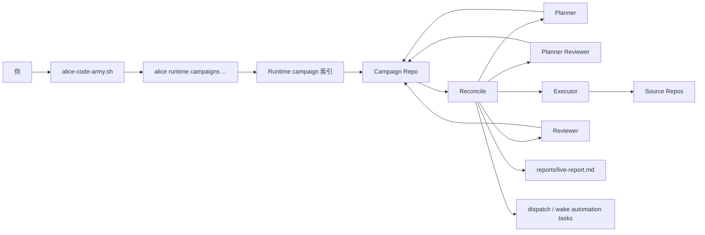
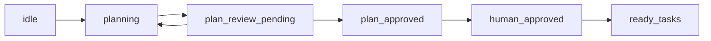
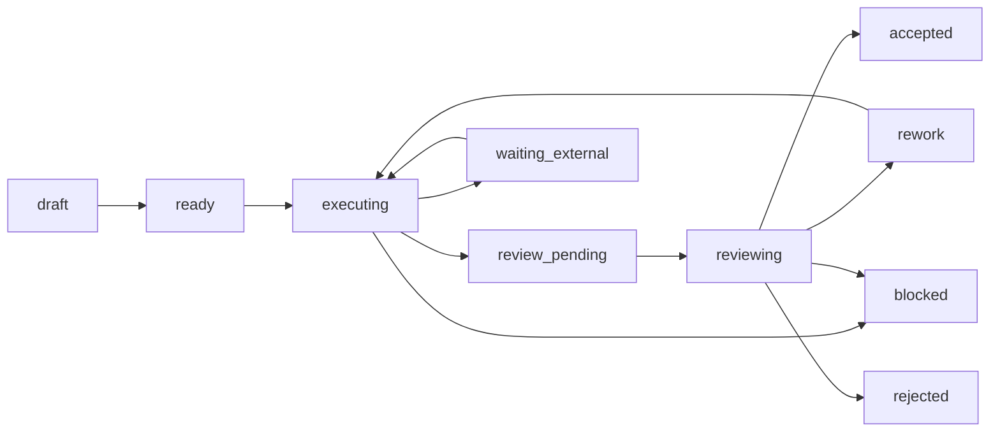

# CodeArmy 使用指南

本文按当前仓库里的真实实现说明 `alice-code-army` 怎么工作、哪些状态会自动推进、哪些步骤仍然需要人来拍板。

如果只记一句话，可以先记这个：

`CodeArmy = skill 脚本 + runtime campaign 索引 + campaign repo 真相源 + 自动 reconcile/dispatch + source repo 实际改动面`

## 先认清入口

如果你是在 Alice 仓库里开发，脚本路径通常是：

- `skills/alice-code-army/scripts/alice-code-army.sh`

如果你是在本机通过 Alice 安装后的 skill 运行，路径通常是：

- `$HOME/.agents/skills/alice-code-army/scripts/alice-code-army.sh`

脚本会按下面顺序找 Alice runtime 二进制：

1. `ALICE_RUNTIME_BIN`
2. `${ALICE_HOME:-$HOME/.alice}/bin/alice`
3. `PATH` 里的 `alice`

所以最少要满足三件事：

- Alice runtime 可执行。
- 当前会话可以访问 runtime API。
- 本地已经有要分析或修改的 source repo。

## 心智模型



最重要的不是箭头顺序，而是职责边界：

- `runtime campaign` 只存轻量索引、summary、会话范围内的管理信息。
- `campaign repo` 才是长期协作的主事实源。
- `source repos` 才是真正改业务代码的地方。
- `GitLab issue / MR` 只是可选镜像，不是主状态源。

## CodeArmy 由哪些部分组成

| 部分 | 在哪里 | 作用 | 你什么时候会碰到 |
| --- | --- | --- | --- |
| 用户入口脚本 | `skills/alice-code-army/scripts/alice-code-army.sh` | 对外提供 `create`、`repo-scan`、`repo-reconcile`、`approve-plan`、`apply-command` 等命令 | 你手动操作 campaign 时 |
| Runtime API | `internal/runtimeapi/campaign_handlers.go` | 管理当前会话范围内的 campaign、trial、guidance、review、pitfall | skill 脚本在后台调用 |
| Runtime campaign store | `internal/campaign/*` | 保存轻量 campaign 索引和摘要 | 你执行 `list/get/patch` 时 |
| Campaign repo loader/reconcile | `internal/campaignrepo/*` | 读取 `campaign.md`、`plans/`、`phases/`、`reviews/`，推进 plan/task 状态并生成 dispatch task | 你执行 `repo-scan`/`repo-reconcile` 或后台自动跑时 |
| 自动化调度 | `internal/bootstrap/campaign_repo_runtime.go` | 周期性 reconcile、事件驱动 reconcile、同步 dispatch/wake task、刷新 live report | 平时不用手动碰，但要理解它在推进流程 |
| Prompt 模板 | `prompts/campaignrepo/*.md.tmpl` | 给 planner、planner reviewer、executor、reviewer 生成 dispatch prompt | 想理解 agent 为什么这么工作时 |
| Campaign repo 模板 | `skills/alice-code-army/templates/campaign-repo/` | 创建标准目录结构和初始 markdown | 新建 campaign 时自动 scaffold |

## Repo First 是什么

`alice-code-army` 现在是标准的 repo-first 结构：

- `campaign repo` 做主事实源：计划、阶段、任务、评审、报告都放在这里。
- `Alice runtime` 做轻量索引层：只记录当前会话绑定哪个 campaign、当前 summary、当前可见范围。
- `source repos` 做真实代码变更面：task 改的是源仓库，不是把代码复制进 campaign repo。
- `GitLab issue / MR` 做可选镜像面：需要给人看时再同步，不是默认真相源。

可以把状态拆成三层看：

| 状态面 | 适合放什么 | 不适合放什么 |
| --- | --- | --- |
| runtime campaign | `title`、`objective`、`campaign_repo_path`、`summary`、`status`、可见性和管理权限 | 详细 task 树、计划原文、review 文件 |
| campaign repo | `campaign.md`、`plans/`、`phases/`、`tasks/`、`reviews/`、`reports/` | 会话路由、runtime scope 之类的瞬时上下文 |
| source repo | 真正的代码、worktree、分支、提交 | campaign 规划元信息 |

一个简单判断方法：

- 你要查“完整发生了什么”，去看 campaign repo。
- 你要查“当前会话里有哪些 campaign、summary 是什么”，去看 runtime campaign。

## Campaign Repo 一般长什么样

新建 campaign 后，模板通常会生成下面这类结构：

```text
campaign-repo/
  campaign.md
  findings.md
  EXPERIMENT_LOG.md
  docs/
    research-contract.md
  repos/
    README.md
    <repo-id>.md
  plans/
    proposals/
      README.md
      round-001-plan.md
    reviews/
      README.md
      round-001-review.md
    merged/
      master-plan.md
  phases/
    P01/
      phase.md
      tasks/
        README.md
        T001.md
        T002.md
  reviews/
    T001/
      R001.md
  reports/
    live-report.md
    phase-reports/
    final-report.md
  _templates/
    task.md
    review.md
    phase.md
    repo.md
    report.md
    plan-proposal.md
    plan-review.md
```

最常看的几个位置：

| 文件/目录 | 作用 | 排障时先看什么 |
| --- | --- | --- |
| `campaign.md` | 总目标、当前 phase、默认角色、`plan_status`、`source_repos` | 当前在第几轮 planning、默认谁来干活 |
| `repos/*.md` | source repo 的本地路径、远端、分支信息 | 真正代码仓库在哪 |
| `plans/proposals/` | planner 产出的 proposal | 当前计划到底写了什么 |
| `plans/reviews/` | planner reviewer 对 proposal 的评审 | 为什么 plan 被通过或打回 |
| `plans/merged/master-plan.md` | 当前认可的总计划 | 人类批准后应参照哪份计划 |
| `phases/Pxx/tasks/Txxx.md` | 单个任务的定义与状态 | 任务卡在哪、能不能派发 |
| `reviews/Txxx/Rxxx.md` | reviewer 的审阅记录 | 为什么通过或返工 |
| `reports/live-report.md` | 系统根据 summary 刷新的全局报告 | 当前活跃任务、阻塞项、下一步 |

## `campaign.md` 里最关键的字段

模板 frontmatter 大致长这样：

```yaml
---
campaign_id: camp_xxx
title: "..."
objective: "..."
status: planned
campaign_repo_path: "/path/to/campaign"
current_phase: P01
source_repos: []
default_executor:
  role: executor.codex
default_reviewer:
  role: reviewer.claude
default_planner:
  role: planner
default_planner_reviewer:
  role: planner_reviewer
plan_round: 0
plan_status: idle
---
```

这些字段最影响系统行为：

| 字段 | 含义 | 什么时候改 |
| --- | --- | --- |
| `campaign_id` | campaign 唯一标识 | 创建时生成 |
| `objective` | 这次协作到底要达成什么 | 创建时写清楚，后续少改 |
| `current_phase` | 当前主阶段 | 进入新阶段时更新 |
| `source_repos` | 本次涉及的源码仓库标识 | planner/executor 需要据此定位代码 |
| `default_planner` / `default_planner_reviewer` | 计划阶段默认角色 | 需要切模型或 provider 时改 |
| `default_executor` / `default_reviewer` | 执行阶段默认角色 | 需要切模型或 provider 时改 |
| `plan_round` | 当前计划轮次 | planning/review 循环里递增 |
| `plan_status` | 计划阶段当前状态 | reconcile 和人工审批共同推进 |

## Task frontmatter 里哪些字段最关键

模板里的 task frontmatter 大致是：

```yaml
---
task_id: T001
title: ""
phase: P01
status: draft
depends_on: []
target_repos: []
working_branches: []
write_scope: []
owner_agent: ""
lease_until: ""
executor:
  role: executor.codex
reviewer:
  role: reviewer.claude
dispatch_state: idle
review_status: pending
execution_round: 0
review_round: 0
base_commit: ""
head_commit: ""
last_run_path: ""
last_review_path: ""
wake_at: ""
wake_prompt: ""
report_snippet_path: "results/report-snippet.md"
artifacts: []
result_paths: []
---
```

最重要的是这些：

| 字段 | 真正影响什么 |
| --- | --- |
| `status` | 当前 task 所在阶段，决定能不能被选中派发 |
| `depends_on` | 依赖没完成就会直接阻塞 |
| `target_repos` | 第一层 repo 冲突判定 |
| `write_scope` | 第二层并行冲突判定 |
| `owner_agent` + `lease_until` | 谁持有任务、租约是否还有效 |
| `execution_round` / `review_round` | 第几轮执行、第几轮审阅 |
| `dispatch_state` | 最近一次派发/裁决到哪一步 |
| `review_status` | 审阅队列状态 |
| `head_commit` / `last_run_path` / `last_review_path` | 执行产物和审阅产物锚点 |
| `wake_at` + `wake_prompt` | 长任务唤醒信息 |

## 计划阶段现在是怎么跑的

当前实现里，planner 和 planner reviewer 已经进入真实的 runtime reconcile 流程，不再只是文档约定。

主流程是：



每个状态的含义：

| `plan_status` | 含义 |
| --- | --- |
| `idle` | 刚创建，还没开始 planning |
| `planning` | planner 该产出 proposal 了 |
| `plan_review_pending` | proposal 已提交，等待 planner reviewer 给 verdict |
| `plan_approved` | 机器评审通过，等待人类批准 |
| `human_approved` | 人类已批准，下一次 reconcile 会把 `draft` task 提升成 `ready` |

补充一点：

- `plan_reviewing` 这个值当前仍被识别为兼容状态，但主流程通常是 `plan_review_pending` 直接进入 `plan_approved` 或回到 `planning`。

planner / planner reviewer 当前实际会做的事：

- `planning` 且本轮还没有 `submitted` proposal 时，系统会生成 planner dispatch task。
- `plan_review_pending` 且本轮还没有 review 文件时，系统会生成 planner reviewer dispatch task。
- planner reviewer 给出 `approve` 后，系统会把 proposal 提升为 `plans/merged/master-plan.md`，并把 `plan_status` 设为 `plan_approved`。
- 人类执行 `approve-plan` 后，`plan_status` 会进入 `human_approved`；下一次 reconcile 才会把 `draft` task 升成 `ready`。

## 执行阶段状态机



常见流转解释：

- `draft -> ready`：计划已人类批准，下一次 reconcile 让任务进入执行候选。
- `ready/rework -> executing`：被 reconcile 选中，并分配 executor、租约、执行轮次。
- `executing -> review_pending`：执行完成，等待 reviewer。
- `review_pending -> reviewing`：被 reconcile 选中进入审阅队列。
- `reviewing -> accepted/rework/blocked/rejected`：Alice 读取 review 文件后应用 verdict。
- `waiting_external -> executing`：wake task 到点或人工恢复后重新继续。

一个非常重要的当前实现细节：

- `accepted` 不等于 `done`。
- `depends_on` 只把依赖任务的 `done` 视为真正完成。
- 所以一个 task 即使已经评审通过，如果你希望它解除下游依赖，仍要把它推进到 `done`。

## 从 0 到 1 最稳的使用路径

### 1. 创建 campaign

```bash
$HOME/.agents/skills/alice-code-army/scripts/alice-code-army.sh create '{
  "title": "Refactor connector retries",
  "objective": "梳理重试策略，降低重复请求，并补齐验证",
  "repo": "group/project",
  "campaign_repo_path": "./campaigns/retry-refactor",
  "max_parallel_trials": 3
}'
```

这一步会：

- 在 runtime campaign store 里创建 campaign。
- 自动 scaffold 一个 campaign repo。
- 如果你没传 `campaign_repo_path`，默认放到 `./campaigns/<slug>`。

### 2. 补齐 campaign repo 的事实源

创建完后先不要急着执行 task，先把这些东西写清楚：

- `campaign.md` 里的 `objective`、`source_repos`、默认角色。
- `repos/*.md` 里的本地路径、远端、默认分支、工作分支。
- `docs/research-contract.md`、`findings.md` 里的约束、事实、假设。

如果 `source_repos` 写不清楚，planner 和 executor 都会缺上下文。

### 3. 触发第一次 reconcile，让 planning 开始

```bash
$HOME/.agents/skills/alice-code-army/scripts/alice-code-army.sh repo-reconcile camp_xxx
```

`repo-reconcile` 才是会真正推进状态的命令。它会：

- 读取 campaign repo。
- 先推进 `plan_status`。
- 再根据 summary 生成 dispatch task。
- 默认重写 `reports/live-report.md`。
- 默认把 summary 回写到 runtime campaign。

第一次 reconcile 后，通常会把 `plan_status` 从 `idle` 推到 `planning`。

### 4. 等 planner 产出 proposal 和 draft tasks

planner 典型会写两类东西：

- `plans/proposals/round-001-plan.md`
- `phases/Pxx/tasks/Txxx.md` 这些 `status: draft` 的任务文件

你要重点检查的不是数量，而是切分质量：

- `depends_on` 是否准确。
- `target_repos` 是否写对。
- `write_scope` 是否足够具体、是否互相重叠。
- task 是否已经拆成可以独立派发的小工作包。

### 5. 等 planner reviewer 审计划

当本轮 proposal 变成 `submitted` 后，`plan_status` 会进入 `plan_review_pending`。

planner reviewer 通常会写：

- `plans/reviews/round-001-review.md`

如果 verdict 是：

- `approve`：进入 `plan_approved`
- `concern` / `blocking` / `reject`：当前 proposal 会被标成 `superseded`，`plan_round` 递增，重新回到 `planning`

### 6. 人类批准计划

```bash
$HOME/.agents/skills/alice-code-army/scripts/alice-code-army.sh approve-plan camp_xxx
```

这一步会：

- 把 runtime campaign 的 `status` 补成 `running`
- 把 campaign repo 里的 `plan_status` 改成 `human_approved`

但它不会立刻把所有 task 变成 `ready`。还要再来一次 reconcile。

### 7. 再跑一次 reconcile，进入执行阶段

```bash
$HOME/.agents/skills/alice-code-army/scripts/alice-code-army.sh repo-reconcile camp_xxx
```

这次 reconcile 会先把 `draft` task 提升成 `ready`，再从 `ready/rework` 里挑出可以并行执行的任务，改成：

- `status: executing`
- `owner_agent: <executor-role>`
- `lease_until: <now + 2h>`
- `execution_round: +1`
- `dispatch_state: executor_dispatched`

它挑任务时主要看三件事：

1. 依赖是否满足。
2. 租约是否过期。
3. `target_repos + write_scope` 是否冲突。

### 8. executor 做完后如何收口

executor 在 source repo 完成工作后，通常应把 task 推到合适状态：

- 可以进审：`review_pending`
- 要等外部结果：`waiting_external`
- 暂时卡住：`blocked`

同时尽量补齐这些锚点：

- `head_commit`
- `last_run_path`
- `results/*.md`
- `progress.md`

### 9. reviewer 只写 review 文件

reviewer 的职责是写审阅文件，例如：

```text
reviews/T001/R001.md
```

它不直接改 source repo，也不直接改 task 状态。下一次 reconcile 时，Alice 会读取 review 并把 verdict 应用成：

- `approve` -> `accepted`
- `concern` -> `rework`
- `blocking` -> `blocked`
- `reject` -> `rejected`

### 10. 长任务用 `waiting_external + wake_at`

如果任务要等流水线、训练结果、人工反馈，不要一直占着 `executing`。更稳的写法是：

- `status: waiting_external`
- `wake_at: 2026-03-26T10:00:00+08:00`
- `wake_prompt: 重新检查训练结果并继续推进`

后台会把它同步成真正的 wake automation task。到点后会自动恢复，不靠人记忆。

## 命令速查

### 核心命令

| 命令 | 用途 | 什么时候用 |
| --- | --- | --- |
| `list` | 列出当前会话里可见的 campaign | 想看有哪些活动 campaign |
| `get CAMP_ID` | 查看单个 runtime campaign | 想看 summary、path、trial、guidance |
| `create JSON` | 创建 campaign 并默认 scaffold repo | 开新 campaign |
| `init-repo CAMP_ID [DIR]` | 给已有 campaign 初始化或补建 repo | runtime 已有记录，但 repo 还没落地 |
| `repo-scan CAMP_ID` | 只扫描 repo，返回 repo-native summary | 只想观察，不想推进状态 |
| `repo-reconcile CAMP_ID` | 推进 repo 状态，刷新 live report | 想真正让系统继续跑 |
| `plan-status CAMP_ID` | 查看 repo 里的 `plan_status` / `plan_round` | 计划阶段排障 |
| `approve-plan CAMP_ID` | 人类批准计划 | planner reviewer 通过之后 |
| `patch CAMP_ID JSON` | 改 runtime campaign 字段 | 改 summary、状态、path 等 |
| `apply-command CAMP_ID '/alice ...'` | 应用高频指导命令 | hold、needs-human、approve-plan、replan 等 |

### 可选命令

| 命令 | 用途 |
| --- | --- |
| `upsert-trial` | 记录或更新 trial |
| `add-guidance` | 追加指导记录 |
| `add-review` | 追加 runtime review 记录 |
| `add-pitfall` | 追加 pitfall 记录 |
| `render-issue-note` / `render-trial-note` | 渲染 GitLab 镜像备注 |
| `sync-issue` / `sync-trial` / `sync-all` | 把摘要同步到 GitLab issue / MR |
| `time-stats` / `time-estimate` / `time-spend` | 走 GitLab issue time tracking |

### `repo-reconcile` 的两个调试开关

运行时命令层支持：

- `--write-report=false`
- `--update-runtime=false`

它们适合排障时“只做 reconcile，不落 live-report”或者“只看 repo 状态，不回写 runtime summary”的场景。

## `/alice` 指令当前支持哪些

通过 `apply-command` 进入的内置指令，当前包括：

| 指令 | 作用 |
| --- | --- |
| `/alice hold` | 把 campaign 置为 `hold` |
| `/alice needs-human ...` | 标记需要人工介入，并把 campaign 置为 `hold` |
| `/alice approve-plan` | 把 plan 置为 `human_approved`，开始进入执行 |
| `/alice steer ...` | 更新方向摘要 |
| `/alice replan ...` | 在 `findings.md` 记一条 replan 原因，`plan_round + 1`，重回 `planning` |
| `/alice blocked ...` | 记录阻塞摘要 |
| `/alice discovery ...` | 追加 discovery 到 `findings.md` |
| `/alice accept <trial_id>` | 接受某个 trial 作为当前 winner candidate |
| `/alice cancel <trial_id>` | 取消某个 trial |

这些命令除了 patch campaign，本身也会追加一条 guidance，方便保留操作痕迹。

## 后台自动化到底在做什么

只要 campaign 不是终态，且 `campaign_repo_path` 不为空，后台就会参与推进。

当前实现里最关键的机制有这些：

- 兜底轮询 reconcile 间隔是 `5` 分钟。
- `campaign_dispatch:*` 和 `campaign_wake:*` 这两类 automation task 完成后，会立即触发一次定向 reconcile，不只是等下一轮定时器。
- dispatch task 和 wake task 会同步到 automation engine。
- dispatch automation task 默认按 `60` 秒粒度存在于调度器里。
- executor/reviewer 的租约默认是 `2` 小时。
- 每次 reconcile 默认会重写 `reports/live-report.md`，并把 summary 同步回 runtime campaign。

因此要记住两件事：

- 手动 `repo-reconcile` 是强制推进。
- 后台自动 reconcile 是“事件驱动 + 兜底轮询”的组合。

## 并行与冲突规则

### `depends_on`

规则很硬：

- 依赖 task 只有进入 `done` 才算真正完成。
- 如果依赖是 `rejected`，当前任务会直接显示为依赖阻塞。
- `accepted` 还不会自动解除依赖。

### `target_repos`

这是并行冲突判定的第一层：

- 不同 repo 默认不冲突。
- 同一个 repo 才继续比较 `write_scope`。

### `write_scope`

这是并行冲突判定的第二层。当前实现按归一化后的前缀重叠判断：

- `internal/connector`
- `internal/connector/retry.go`

这两个会被视为冲突。

还有一个非常关键的规则：

- 同 repo 下，只要任一 task 的 `write_scope` 为空，就会被当成潜在全局改动，直接视为冲突。

推荐写法：

- 不要留空。
- 尽量写到模块或目录层级。
- 不要直接写仓库根目录，除非你真的在做全局改动。

## 常见误区

### 误区 1：`repo-scan` 为什么没让任务跑起来

因为 `repo-scan` 只扫描，不推进状态。真正推进状态的是 `repo-reconcile`。

### 误区 2：我已经 `approve-plan` 了，为什么 task 还是 `draft`

因为 `approve-plan` 只是把 `plan_status` 改成 `human_approved`。要等下一次 reconcile，系统才会把 `draft` 提升成 `ready`。

### 误区 3：两个 task 明明改不同文件，为什么还是被判冲突

最常见原因：

- `target_repos` 相同，但其中一个 `write_scope` 为空。
- 你写的是父目录和子目录，例如 `internal/connector` 和 `internal/connector/retry`，系统会认为它们重叠。

### 误区 4：review 已经通过了，为什么下游任务还是没解锁

因为当前依赖判定看的是 `done`，不是 `accepted`。评审通过后如果要真正解除依赖，还需要把任务收口到 `done`。

### 误区 5：reviewer 为什么不能顺手改代码

因为当前工作流明确把 reviewer 限定为“只写审阅结论”。这样 Alice 才能清楚地区分：

- 谁在执行
- 谁在审
- 谁在应用 verdict

### 误区 6：GitLab issue / MR 里已经有记录了，为什么还要看 campaign repo

因为 GitLab 在这里是镜像面，不是主事实源。真正完整、可机读、可 reconcile 的状态都在 campaign repo。

## 推荐的最小使用姿势

如果你刚开始用，建议按这个节奏：

1. `create` 一个 campaign，让 repo 模板先落地。
2. 补齐 `campaign.md` 和 `repos/*.md`，把目标和本地仓库路径写清楚。
3. 手动跑一次 `repo-reconcile`，让 planning 开始。
4. 检查 planner 生成的 proposal 和 `draft` tasks，重点看 `depends_on` 和 `write_scope`。
5. 等 plan review 通过后，手动 `approve-plan`。
6. 再跑一次 `repo-reconcile`，让 `draft` task 升成 `ready` 并开始派发。
7. 始终把 `reports/live-report.md` 当作全局驾驶舱。

## 不知道系统在干什么时，先看哪些文件

按这个顺序通常最省时间：

1. `reports/live-report.md`
2. `campaign.md`
3. `plans/proposals/round-xxx-plan.md`
4. `plans/reviews/round-xxx-review.md`
5. `phases/Pxx/tasks/Txxx.md`
6. `reviews/Txxx/Rxxx.md`
7. runtime campaign 的 `summary`

看完这些文件，基本就能还原一个 campaign 现在所处的位置。
